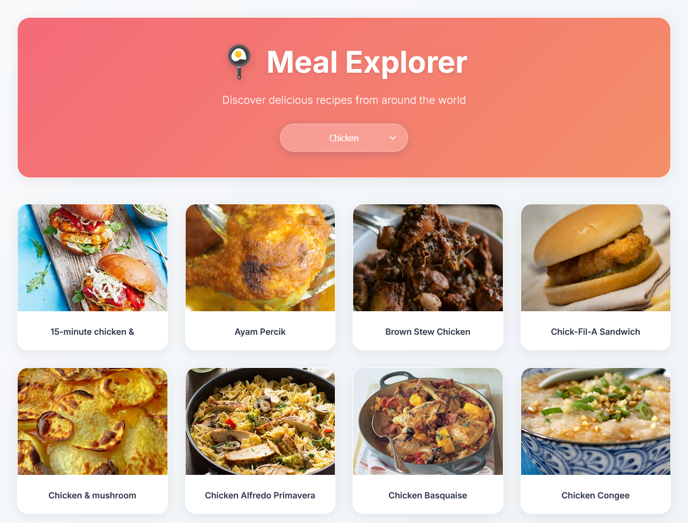
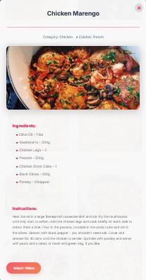

# Meal Explorer

**Meal Explorer** is an interactive web project that showcases delicious meals from the [TheMealDB](https://www.themealdb.com/) API.  
You can choose a category (like Beef, Chicken, Dessert, etc.), view the related meals, and click on one to see full details — including ingredients, cooking instructions, and even a YouTube tutorial video (if available).

---

## 🔗 Live Demo

Check out the live project hosted on GitHub Pages:  
[Meal Explorer Live](https://mahmoud25osama.github.io/Meal-Explorer/)

---

## ✨ Features

- Browse meals by category.  
- Display meal images and titles.  
- Click on a meal to view detailed information:
  - Ingredients & measurements  
  - Cooking instructions  
  - Cuisine / Area  
  - YouTube tutorial link (if available)  
- Simple, fast, and responsive UI.

---

## 🛠️ Built With

- **HTML / CSS**  
- **JavaScript (Vanilla JS)** with `XMLHttpRequest`  
- **External API:** [TheMealDB](https://www.themealdb.com)

---

## 📷 Screenshot


### Modal description


---

## 🚀 Getting Started

Follow these steps to run the project locally:

1. Clone the repository:
   ```bash
   git clone https://github.com/mahmoud25osama/Meal-Explorer.git
   ````

2. Navigate to the project folder:

   ```bash
   cd Meal-Explorer
   ```
3. Open `index.html` in your browser.
   *(No server setup required — it runs directly in the browser.)*

---

## 📂 Project Structure

```
Meal-Explorer/
├── index.html
├── style.css        # Styling (if included)
├── script.js        # JavaScript logic
└── README.md
```

---

## 🔮 Future Improvements

* Replace `XMLHttpRequest` with modern `fetch()` for cleaner code.
* Add a **search bar** to find meals by name.
* Implement **favorites** using Local Storage.
* Improve UI/UX with better styling and animations.
* Add **Dark Mode** support.
* Refactor into a modern framework (React, Vue, or Angular).

---

## 👨‍💻 Author

**Mahmoud Osama**
🔗 [GitHub Profile](https://github.com/mahmoud25osama)

---


